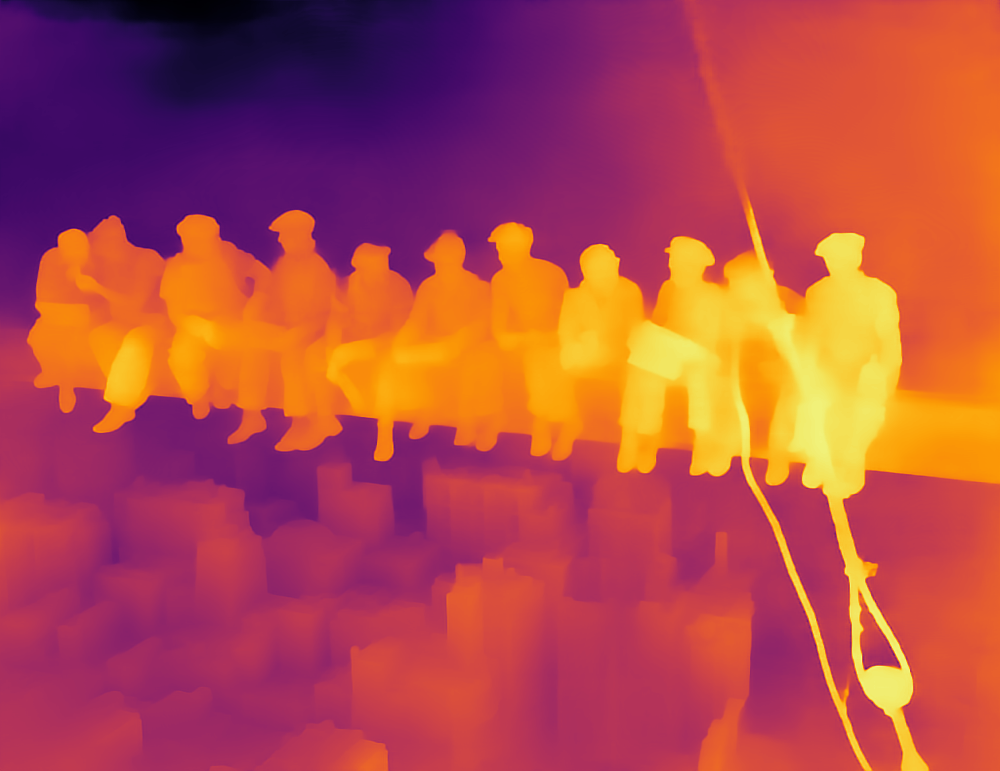
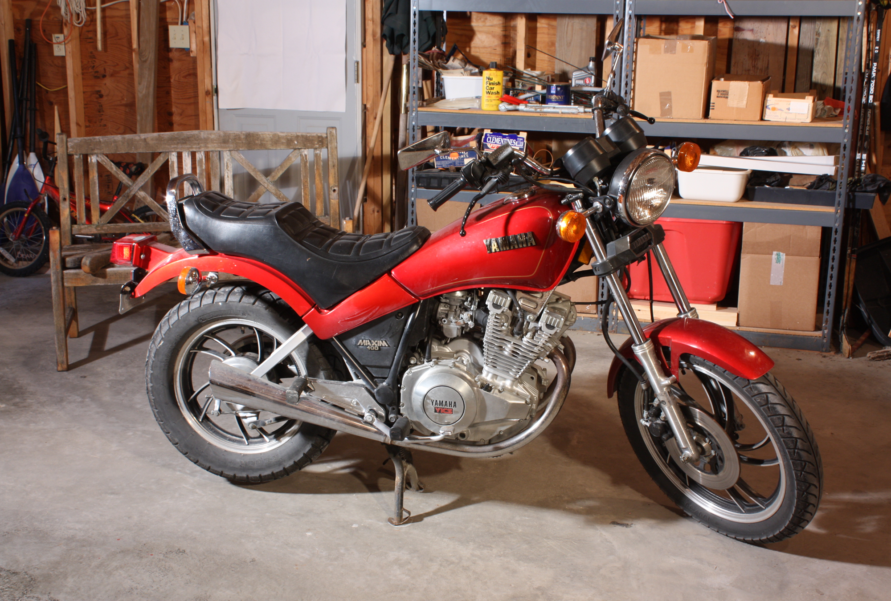
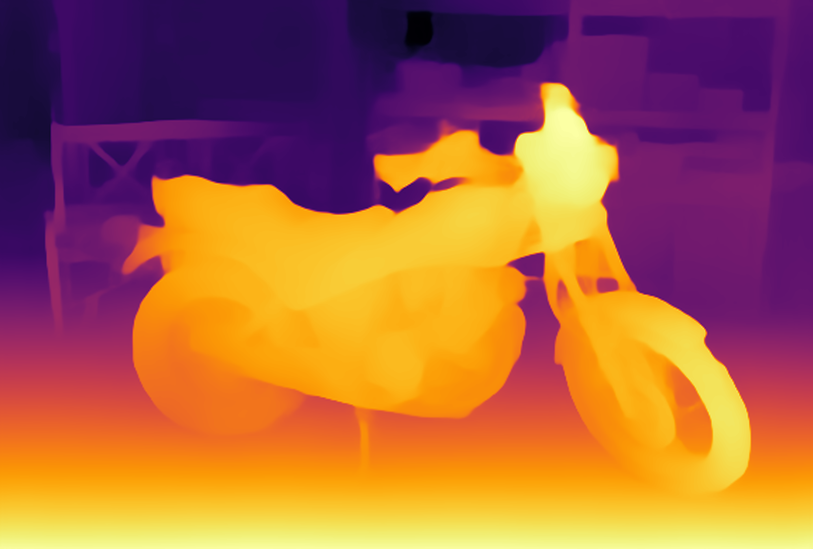
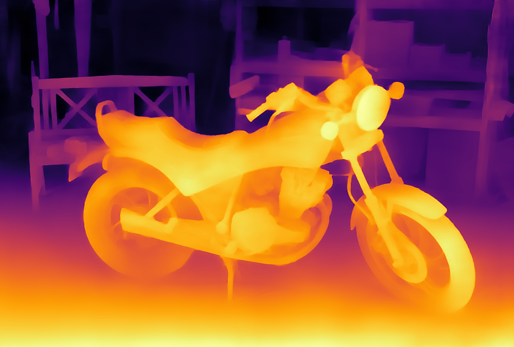
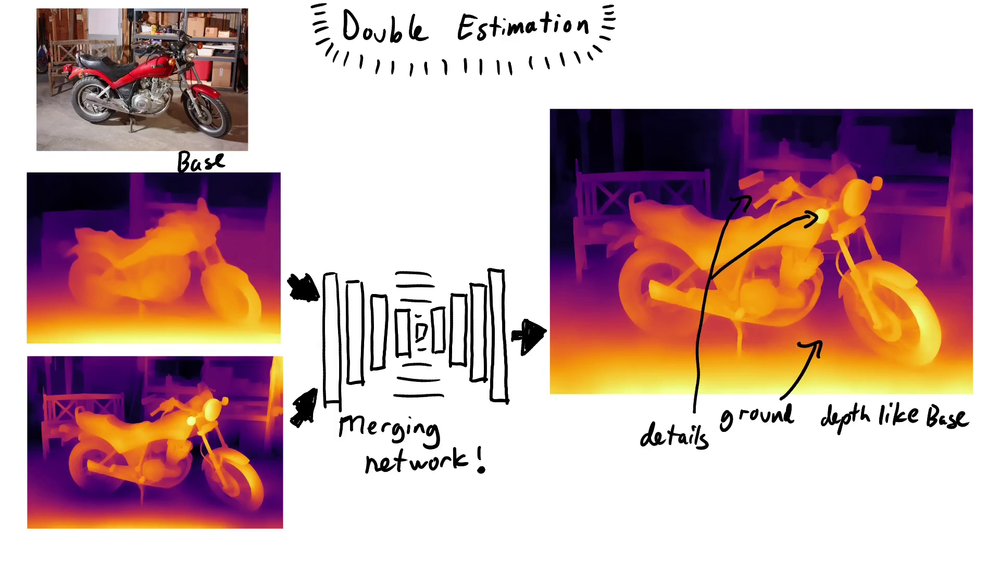
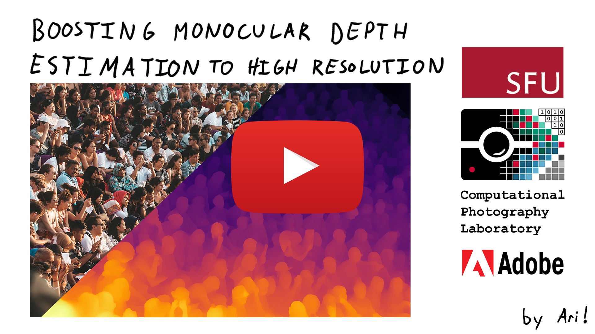

# MergeNet - Boost Your Own Depth

## Boost custom or edited monocular depth maps using MergeNet


| Input | Original result | After manual editing of base|
|----|------------|------------|
||||

You can find our [Google Colaboratory notebook here](./colab/byod.ipynb).   [](https://colab.research.google.com/github/compphoto/BoostYourOwnDepth/blob/main/colab/byod.ipynb)

In this repository, we present a stand-alone implementation of our merging operator we use in our recent work:

### Boosting Monocular Depth Estimation Models to High-Resolution via Content-Adaptive Multi-Resolution Merging 
> S. Mahdi H. Miangoleh\*, Sebastian Dille\*, Long Mai, Sylvain Paris, Yağız Aksoy.
> [Video](https://www.youtube.com/watch?v=lDeI17pHlqo),
> [Main pdf](http://yaksoy.github.io/papers/CVPR21-HighResDepth.pdf),
> [Supplementary pdf](http://yaksoy.github.io/papers/CVPR21-HighResDepth-Supp.pdf),
> [Project Page](http://yaksoy.github.io/highresdepth/).
> [Github repo](https://github.com/compphoto/BoostingMonocularDepth).


## If you are an artist:

Although we are presenting few simple examples here, both low-resolution and high-resolution depth maps can be freely edited using any program before merging with our method.

Feel free to experiment and share your results with us!

## If you are a researcher developing a new (CNN-based) Monocular Depth Estimation method:

This repository is a full implementation of our double-estimation framework. Double estimation uses a base-resolution result and a high-resolution result. The optimum high-resolution for a given image, R20 resolution, depends on the receptive field size of your network (the training resolution is a good approximation) and the image content. The code for R20 computation is also provided here.

To demonstrate the high-resolution performance of your network, you can simply generate the base and high-res estimates on any dataset and use this repository to apply our double estimation method to your own work.

Our [Github repo](https://github.com/compphoto/BoostingMonocularDepth) for the main project also includes the implementation of our detail-focused monocular depth performance metric D^3R.


## Mix'n'match depths from different networks or use your own custom-edited ones. 
In the image below, we show that choosing a different base estimate can improve the depth for the city in the image below:
| Input | Base and details from [MiDaS][1] | Base from [LeRes][2] and details from [MiDaS][1]|
|----|------------|------------|
||||

To get the optimal result for a given scene, you may want to try multiple methods in both low- and high-resolutions and pick your favourite for each case.
| Input | Base from [MiDaS v3 / DPT][3] | Base from [MiDaS v3 / DPT][3] and details from [MiDaS v2][1]|
|----|------------|------------|
||||

Moreover, you can simply edit the base image before merging using any image editing tool for more creative control:
| Input | Base and details from [MiDaS][1] | With edited base from [MiDaS][1]|
|----|------------|------------|
||||


## How does it work?



## This repository lets you combine two input depth maps with certain characteristics.

### Low-res base depth

The network uses the base estimate as the main structure of the scene. Typically this is the default-resolution result of a monocular depth estimation network at around 300x300 resolution. 

This base estimate is a good candidate for editing due to its low-resolution nature.

Monocular depth estimation methods with geometric consistency optimizations can be used as the base estimation to merge details onto a consistent base.

### High-res depth with details

The merging operation transfers the details from this high-resolution depth map onto the structure provided by the low-resolution base pair.

The high-resolution input does not need structural consistency and is typically generated by feeding the input image at a much higher resolution than the training resolution of a given monocular depth estimation network.

You can compute the optimal high-resolution estimation size for a given image using our R20 resolution calculator, also provided in this repository. You can also simply use 2x or 3x resolution to simply add more details.


For more information on this project:
### Boosting Monocular Depth Estimation Models to High-Resolution via Content-Adaptive Multi-Resolution Merging 

> S. Mahdi H. Miangoleh\*, Sebastian Dille\*, Long Mai, Sylvain Paris, Yağız Aksoy.
> [Main pdf](http://yaksoy.github.io/papers/CVPR21-HighResDepth.pdf),
> [Supplementary pdf](http://yaksoy.github.io/papers/CVPR21-HighResDepth-Supp.pdf),
> [Project Page](http://yaksoy.github.io/highresdepth/).
> [Github repo](https://github.com/compphoto/BoostingMonocularDepth).

[](https://www.youtube.com/watch?v=lDeI17pHlqo)

## Citation

This implementation is provided for academic use only. Please cite our paper if you use this code or any of the models.
```
@INPROCEEDINGS{Miangoleh2021Boosting,
author={S. Mahdi H. Miangoleh and Sebastian Dille and Long Mai and Sylvain Paris and Ya\u{g}{\i}z Aksoy},
title={Boosting Monocular Depth Estimation Models to High-Resolution via Content-Adaptive Multi-Resolution Merging},
journal={Proc. CVPR},
year={2021},
}
```

## Credits

The "Merge model" code skeleton (./pix2pix folder) was adapted from the [pytorch-CycleGAN-and-pix2pix][4] repository.\
[1]: https://github.com/intel-isl/MiDaS/tree/v2 \
[2]: https://github.com/aim-uofa/AdelaiDepth/tree/main/LeReS \
[3]: https://github.com/isl-org/DPT \
[4]: https://github.com/junyanz/pytorch-CycleGAN-and-pix2pix \


